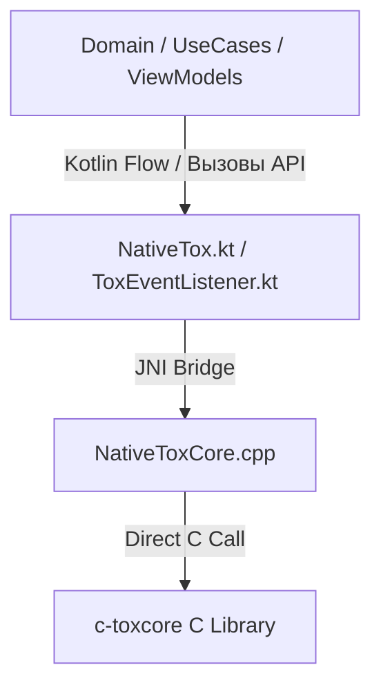

# Руководство разработчика: Работа с JNI-слоем Tox (модуль Core)

Данный документ описывает архитектуру нативного JNI-слоя, работу с шиной событий `ToxEventListener` и использование низкоуровневых интерфейсов `NativeTox` для реализации P2P-коммуникаций в приложении aTox.

---

## 1. Архитектура и основные компоненты

Наш P2P-слой построен как трехслойный мост между нативной библиотекой `c-toxcore` на языке C++ и кодовой базой Kotlin на стороне Android:



### Описание слоев:
1. **`c-toxcore` (C Library)**: Оригинальная библиотека протокола Tox. Отвечает за шифрование (NaCl), установку DHT-соединений, маршрутизацию UDP/TCP пакетов и аудио-видео кодеки.
2. **`NativeToxCore.cpp` (JNI C++)**: Прослойка на C++, которая транслирует вызовы из Java/Kotlin-окружения в вызовы функций Tox Core, конвертирует массивы байт (`jbyteArray` <-> `uint8_t*`) и кэширует Method IDs слушателей для диспетчеризации асинхронных коллбеков.
3. **`NativeTox.kt` (JNI Bridge)**: Kotlin-класс с объявлением `external fun` методов. Содержит KDoc на русском языке для всех 40+ JNI-методов.
4. **`ToxEventListener.kt` (Event Loop Dispatcher)**: Центральный Kotlin-приемник событий от C++ слоя. Вся диспетчеризация входящих сообщений, файлов, приглашений и звонков проходит через его типизированные `typealias` лямбды.

---

## 2. Жизненный цикл и потокобезопасность (Thread Safety)

> [!WARNING]
> **Tox не является потокобезопасным мессенджером!** Вы не можете параллельно вызывать нативные методы Tox из разных потоков JVM. 
> Все вызовы JNI-методов `NativeTox` и цикл интеграции событий должны осуществляться строго в **однопоточном диспетчере (Single-Threaded Dispatcher)** или быть синхронизированными.

### Нативный Event Loop (toxIterate)
События из сети Tox не приходят мгновенно сами по себе. Ядро Tox должно регулярно опрашиваться методом `toxIterate()`.

**Принцип работы бесконечного цикла ядра:**
```kotlin
val toxThread = Executors.newSingleThreadScheduledExecutor()

toxThread.submit {
    while (isToxRunning) {
        // Выполняем одну итерацию обработки сетевых пакетов
        NativeTox.toxIterate(toxPointer)
        
        // Спрашиваем у ядра, через сколько миллисекунд нужно сделать следующую итерацию
        val interval = NativeTox.toxIterationInterval(toxPointer)
        
        Thread.sleep(interval.toLong())
    }
}
```

---

## 3. Практические примеры использования API

### 3.1. Инициализация инстанса Tox (с поддержкой прокси/Tor)
При создании инстанса Tox можно гибко включать поддержку IPv6, прямых UDP-соединений, автообнаружение в локальной сети, а также безопасную маршрутизацию трафика (Tor / SOCKS5 / HTTP):

```kotlin
// Пример запуска через локальный демон Tor (127.0.0.1:9050)
val savedataBytes: ByteArray? = loadSavedProfileBytes() // null, если это новый профиль

val toxPointer = NativeTox.toxNewWithOptions(
    savedata = savedataBytes,
    ipv6Enabled = true,
    udpEnabled = true, // true разрешает прямые P2P-соединения
    localDiscoveryEnabled = true, // для переписки в одной Wi-Fi сети без интернета
    proxyType = 2, // 0 - без прокси, 1 - HTTP, 2 - SOCKS5 (Tor)
    proxyHost = "127.0.0.1",
    proxyPort = 9050
)

if (toxPointer != 0L) {
    Log.d("ToxCore", "Инстанс Tox успешно запущен!")
}
```

### 3.2. Регистрация шины событий (ToxEventListener)
Шина событий регистрируется нативным глобальным указателем при первом обращении:

```kotlin
val eventListener = ToxEventListener()

// 1. Слушаем входящие сообщения от друзей
eventListener.friendMessageHandler = { friendPublicKey, messageId, type, messageText ->
    Log.d("ToxEvent", "Новое сообщение от $friendPublicKey: $messageText")
    // Сохраняем в локальную БД Room и обновляем UI
}

// 2. Слушаем статус набора текста
eventListener.friendTypingHandler = { friendPublicKey, isTyping ->
    Log.d("ToxEvent", "Друг $friendPublicKey печатает: $isTyping")
}

// 3. Слушаем входящие приглашения в группы
eventListener.conferenceInviteHandler = { friendNo, type, cookie ->
    Log.d("ToxEvent", "Приглашение в группу от друга #$friendNo")
    // Можно автоматически принять или показать диалог пользователю
    val confId = NativeTox.toxConferenceJoin(toxPointer, friendNo, cookie)
}

// 4. Слушаем изменение названий групповых чатов
eventListener.conferenceTitleHandler = { conferenceNo, peerNo, newTitle ->
    Log.d("ToxEvent", "В группе #$conferenceNo участник #$peerNo сменил заголовок на: $newTitle")
}
```

### 3.3. Безопасность и Сетевые параметры узла
Для экспорта приватных ключей, определения портов и диагностики сетевой доступности используются следующие методы:

```kotlin
// Экспорт секретного ключа для резервной копии профиля
val secretKey: ByteArray = NativeTox.toxSelfGetSecretKey(toxPointer)

// Получение активных портов узла в памяти устройства
val activeUdpPort: Int = NativeTox.toxSelfGetUdpPort(toxPointer)
val activeTcpPort: Int = NativeTox.toxSelfGetTcpPort(toxPointer)

// Диагностический ключ DHT (DHT Public Key)
val dhtPublicKey: ByteArray = NativeTox.toxSelfGetDhtId(toxPointer)
```

### 3.4. Прямые синхронные запросы контактов
В отличие от асинхронных коллбеков, вы можете синхронно и мгновенно запросить состояние любого контакта из ядра Tox:

```kotlin
val friendNo = 5

if (NativeTox.toxFriendExists(toxPointer, friendNo)) {
    // 1. Получаем имя и статус-сообщение
    val name = String(NativeTox.toxFriendGetName(toxPointer, friendNo))
    val statusMsg = String(NativeTox.toxFriendGetStatusMessage(toxPointer, friendNo))
    
    // 2. Проверяем соединение (0 - Offline, 1 - TCP-relay, 2 - UDP-direct)
    val connType = NativeTox.toxFriendGetConnectionStatus(toxPointer, friendNo)
    
    // 3. Получаем время последней активности (для надписи "Был в сети X минут назад")
    val lastOnlineSec: Long = NativeTox.toxFriendGetLastOnline(toxPointer, friendNo)
    
    Log.d("ToxDirect", "Контакт: $name ($statusMsg), Связь: $connType, Последний раз онлайн: $lastOnlineSec")
}
```

### 3.5. Работа с Конференциями (Групповыми чатами)
Полный цикл создания группы, управления её заголовками и определения своего авторства в переписке:

```kotlin
// 1. Создание новой группы
val conferenceNo = NativeTox.toxConferenceNew(toxPointer)

// 2. Установка названия (заголовка) группы
val newTitle = "Рабочий чат EvilCorp"
NativeTox.toxConferenceSetTitle(toxPointer, conferenceNo, newTitle.toByteArray())

// 3. Проверка авторства сообщения (для отображения в UI справа или слева)
eventListener.conferenceMessageHandler = { confNo, peerNo, type, messageText ->
    val isItMe = NativeTox.toxConferencePeerNumberIsOurself(toxPointer, confNo, peerNo)
    if (isItMe) {
        showMyMessage(messageText)
    } else {
        val senderName = String(NativeTox.toxConferenceGetPeerName(toxPointer, confNo, peerNo))
        showPeerMessage(senderName, messageText)
    }
}
```

---

## 4. Рекомендации по интеграции с базой данных (Android Room)

Для обеспечения превосходного пользовательского опыта (UX) приложение aTox не должно напрямую зависеть от нативного состояния в памяти. 
* **Кэшируйте всё в Room БД**: Вся переписка, имена участников групп, заголовки чатов и оффлайн-состояния контактов должны сохраняться в локальную базу данных внутри лямбда-обработчиков `ToxEventListener`.
* **Используйте Kotlin Flow / LiveData**: UI-экраны (`Compose`/`XML`) должны подписываться на реактивные `Flow` от Room DAO.
* **Автосохранение (SaveManager)**: Не забывайте периодически выгружать сериализованные данные состояния с помощью `NativeTox.toxGetSavedata(toxPointer)` и безопасно сохранять их на диск устройства. Это предотвратит потерю ключей шифрования при внезапном закрытии приложения операционной системой Android.
